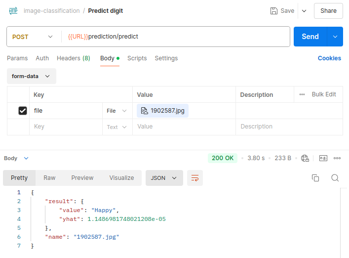
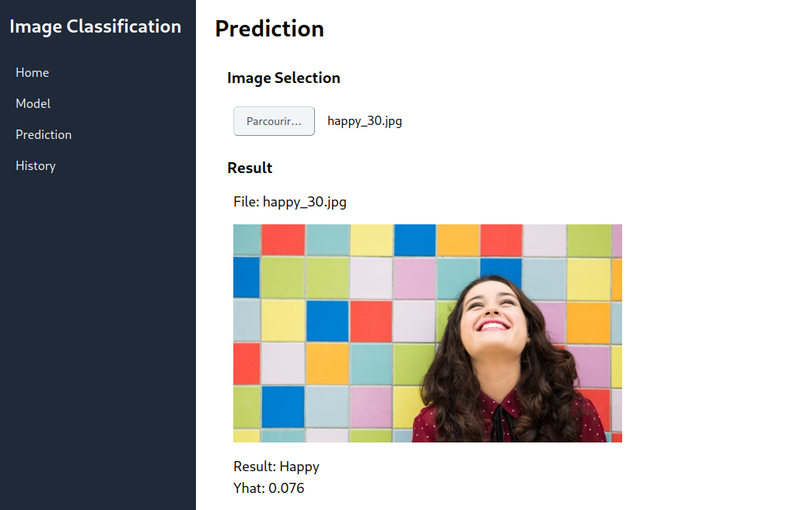
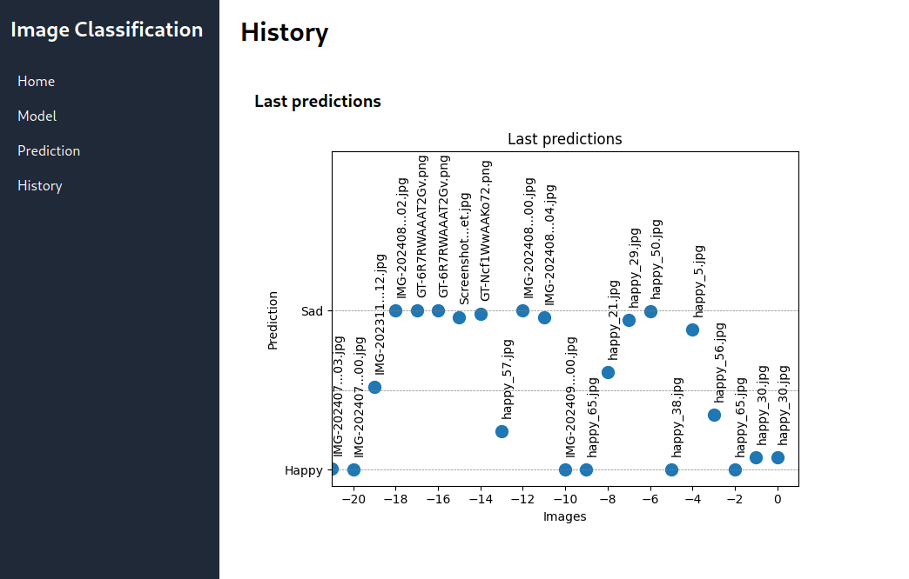
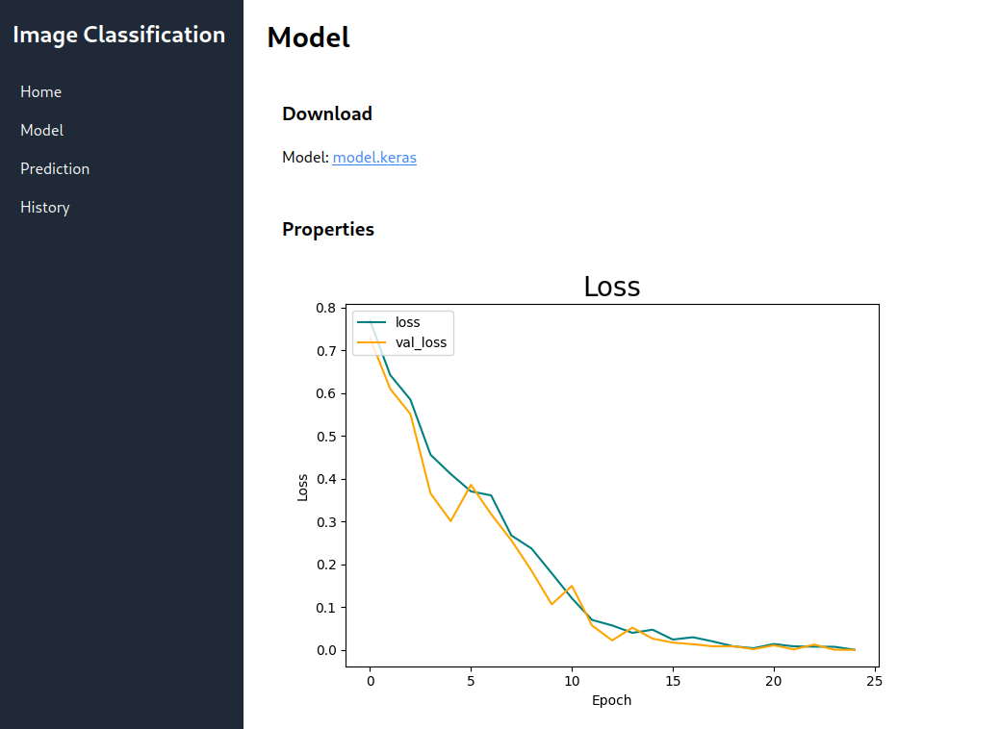

# About

This is an image classification app using a convolutional neural network to predict whether the image qualifies as *happy* or *sad*.

The workflow:

- builds, trains and tests the model
- produces and publishes a docker container
- updates the app on a production server

This app provides both an API and a web UI.

### API

### Web User Interface

